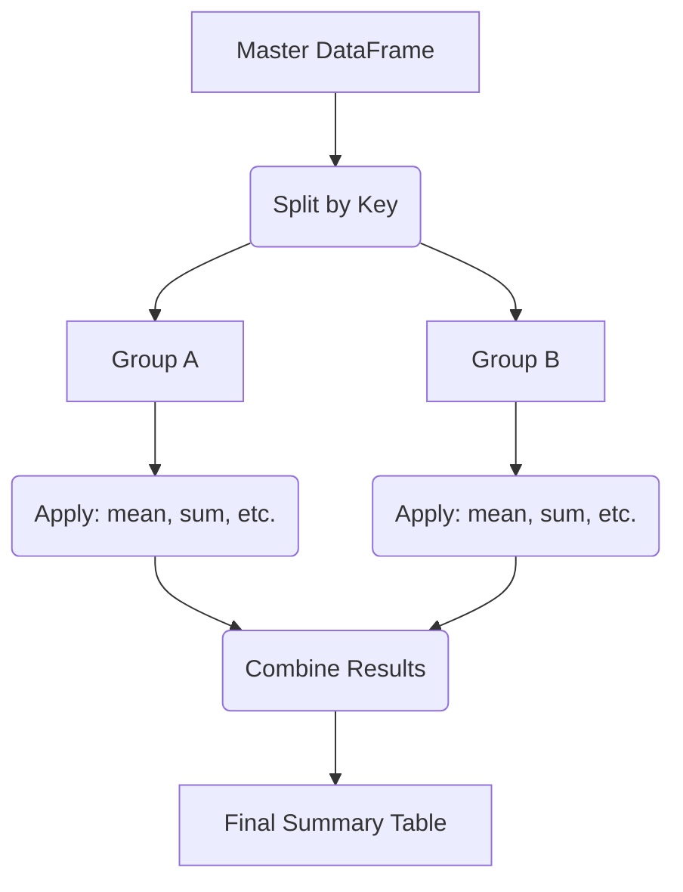

# GroupBy and Aggregation (split-apply-combine)

## Lesson Overview

- This chapter explores the GroupBy mechanism in Pandas, which implements the **Split-Apply-Combine** workflow.
- In data analysis, we frequently need to slice datasets based on categorical fields to summarize metrics (e.g. calculating average sales per department, identifying top-selling items by region, or standardizing patient metrics based on demographic age brackets).
- We will cover grouping syntax, multi-column summarizations using `.agg()`, transforming group entries using `.transform()`, and filtering groups dynamically using `.filter()`.
- Mastering GroupBy operations enables you to summarize complex datasets and compute group-level statistics.

## Learning Objectives

- Understand the Split-Apply-Combine mechanism in Pandas.
- Group DataFrames by single or multiple categorical columns using `.groupby()`.
- Apply custom and multiple aggregation functions using the `.agg()` interface.
- Use `.transform()` to generate group-level statistics without collapsing the DataFrame.
- Filter groups dynamically using the `.filter()` method.
- Diagnose and resolve indexing challenges associated with MultiIndexed group outputs.

---

## The Split-Apply-Combine Pattern

The GroupBy process is broken down into three stages:
1. **Split**: The DataFrame is divided into smaller chunks based on key values.
2. **Apply**: A function (like aggregation, transformation, or filtering) is applied to each chunk.
3. **Combine**: The individual chunk results are merged back into a single output object.



### Setup for Demonstration

```python
import pandas as pd

# Sales registrations
df_sales = pd.DataFrame({
    "Region": ["East", "West", "East", "West", "East", "West"],
    "Product": ["Tech", "Tech", "Home", "Home", "Tech", "Home"],
    "Revenue": [12000, 15000, 8000, 7500, 14000, 9000],
    "Units": [12, 15, 8, 5, 10, 6]
})

print("--- Master Sales Table ---")
print(df_sales)
```

### Output

```text
--- Master Sales Table ---
  Region Product  Revenue  Units
0   East    Tech    12000     12
1   West    Tech    15000     15
2   East    Home     8000      8
3   West    Home     7500      5
4   East    Tech    14000     10
5   West    Home     9000      6
```

---

## 1. Basic Grouping and Aggregation

Use `.groupby()` to partition the dataset. Follow it with an aggregation function to summarize numeric columns.

```python
# Group by Region and calculate total revenue and units
region_totals = df_sales.groupby("Region")[["Revenue", "Units"]].sum()

print("--- Regional Sales Totals ---")
print(region_totals)
```

### Output

```text
--- Regional Sales Totals ---
        Revenue  Units
Region                
East      34000     30
West      31500     26
```
*Note: The grouped column ('Region') becomes the index of the resulting DataFrame.*

---

## 2. Advanced Aggregations with `.agg()`

The `.agg()` method allows you to apply different aggregation functions to different columns, or apply multiple functions to the same column.

```python
# Apply multiple aggregations to Revenue and Units
agg_results = df_sales.groupby("Region").agg({
    "Revenue": ["sum", "mean", "max"],
    "Units": "sum"
})

print("--- Advanced Aggregations ---")
print(agg_results)
```

### Output

```text
--- Advanced Aggregations ---
        Revenue                 Units
            sum          mean   max   sum
Region                                   
East      34000  11333.333333 14000    30
West      31500  10500.000000 15000    26
```
*Note: Applying multiple aggregations creates a DataFrame with a MultiIndexed column layout.*

---

## 3. Group Transformations with `.transform()`

While standard aggregation collapses the dataset, `.transform()` applies a group-level calculation and returns an object of the **same size** as the original DataFrame. This is useful for imputing group means or calculating percentage contributions.

```python
# Calculate the percentage contribution of each transaction to its region's total revenue
region_revenue_sums = df_sales.groupby("Region")["Revenue"].transform("sum")

print("--- Intermediate Sums Series ---")
print(region_revenue_sums)

# Compute percentage
df_sales["Region_Pct"] = (df_sales["Revenue"] / region_revenue_sums) * 100
print("\n--- Sales DataFrame with Contribution Pct ---")
print(df_sales)
```

### Output

```text
--- Intermediate Sums Series ---
0    34000
1    31500
2    34000
3    31500
4    34000
5    31500
Name: Revenue, dtype: int64

--- Sales DataFrame with Contribution Pct ---
  Region Product  Revenue  Units  Region_Pct
0   East    Tech    12000     12   35.294118
1   West    Tech    15000     15   47.619048
2   East    Home     8000      8   23.529412
3   West    Home     7500      5   23.809524
4   East    Tech    14000     10   41.176471
5   West    Home     9000      6   28.571429
```

---

## 4. Group Filtering with `.filter()`

Use `.filter()` to drop records belonging to groups that do not satisfy a group-level condition. The function passed to `.filter()` must return a boolean scalar.

```python
# Keep only regions that have generated a total revenue greater than 32,000
filtered_regions = df_sales.groupby("Region").filter(lambda x: x["Revenue"].sum() > 32000)

print("--- Regions with Revenue > 32,000 ---")
print(filtered_regions)
```

### Output

```text
--- Regions with Revenue > 32,000 ---
  Region Product  Revenue  Units  Region_Pct
0   East    Tech    12000     12   35.294118
2   East    Home     8000      8   23.529412
4   East    Tech    14000     10   41.176471
```
*Note: West region records are removed because West's total revenue was 31,500 (less than 32,000).*

---

## Common Mistakes Students Make

- **Using `.groupby()` without an aggregation function**: Running `df.groupby('Col')` returns a `DataFrameGroupBy` object, not a DataFrame. You must call an aggregation function (like `.mean()`, `.sum()`, etc.) to get a summary table.
- **Unexpected index changes**: After grouping, the grouped column becomes the index. Students often get errors when trying to access it as a column. Use `.groupby('Col', as_index=False)` or run `.reset_index()` on the result to keep the grouped column as a regular column.
- **Mismatched lengths in `.transform()` vs `.apply()`**: Trying to use `.apply()` when you need to assign values back to the original DataFrame size is a common pitfall. `.transform()` guarantees the return shape matches the input, whereas `.apply()` returns a reduced group summary or variable shape.
- **Incorrect logic in `.filter()`**: The lambda function inside `.filter()` takes the entire sub-DataFrame of the group as input, not individual rows. Writing `df.groupby('A').filter(lambda x: x['B'] > 5)` checks if the *entire Series* is greater than 5, which fails. Use group-level aggregations inside filter: `lambda x: x['B'].mean() > 5`.

---

## Best Practices

- Use `as_index=False` inside `.groupby()` to keep the grouping columns as regular columns in the output DataFrame.
- Use dictionaries inside `.agg()` to specify different calculations for different columns, improving code readability.
- When generating normalizations (like centering data by group means), use `.transform()` to keep index alignment.
- Run `.reset_index()` on MultiIndexed group columns to flatten index headers for downstream processing.

---

## Worked Real-World Examples

### Worked Example 1: Standardizing HR Salary Ranges

```python
import pandas as pd

# HR Employee records
employees = pd.DataFrame({
    "Department": ["HR", "HR", "Sales", "Sales", "Tech", "Tech"],
    "Name": ["Aarav", "Neha", "Rajesh", "Pooja", "Vikram", "Kiran"],
    "Salary": [50000, 60000, 75000, 85000, 110000, 130000]
})

# 1. Calculate the mean salary for each department
dept_means = employees.groupby("Department")["Salary"].transform("mean")

# 2. Calculate salary deviation from the department mean
employees["Deviation"] = employees["Salary"] - dept_means

print("--- Salary Deviations ---")
print(employees)
```

### Output

```text
--- Salary Deviations ---
  Department    Name  Salary  Deviation
0         HR   Aarav   50000    -5000.0
1         HR    Neha   60000     5000.0
2      Sales  Rajesh   75000    -5000.0
3      Sales   Pooja   85000     5000.0
4       Tech  Vikram  110000   -10000.0
5       Tech   Kiran  130000    10000.0
```

---

### Worked Example 2: E-commerce Customer Loyalty Filter

```python
import pandas as pd

# Purchase records
purchases = pd.DataFrame({
    "CustomerID": ["C101", "C102", "C101", "C103", "C102", "C101"],
    "Item": ["Shoes", "Hat", "Bag", "Shoes", "Shoes", "Belt"],
    "Amount": [120, 45, 300, 85, 150, 40]
})

# Filter out transactions from customers who have spent less than $200 in total
loyal_customers = purchases.groupby("CustomerID").filter(lambda x: x["Amount"].sum() >= 200)

print("--- Purchases from High-Value Customers ---")
print(loyal_customers)
```

### Output

```text
--- Purchases from High-Value Customers ---
  CustomerID   Item  Amount
0       C101  Shoes     120
1       C102    Hat      45
2       C101    Bag     300
4       C102  Shoes     150
5       C101   Belt      40
```
*Note: C103 is filtered out because their total spend was only $85.*

---

### Worked Example 3: Multi-Column Aggregations

```python
import pandas as pd

# Store product inventory
inventory = pd.DataFrame({
    "Store": ["S1", "S1", "S2", "S2", "S1", "S2"],
    "Category": ["Apparel", "Tech", "Apparel", "Tech", "Apparel", "Apparel"],
    "Quantity": [10, 5, 15, 8, 12, 20],
    "Price": [25.00, 800.00, 30.00, 750.00, 22.00, 28.00]
})

# Group by Store and Category, returning quantity totals and price averages
inventory_summary = inventory.groupby(["Store", "Category"]).agg({
    "Quantity": "sum",
    "Price": "mean"
}).reset_index()

print("--- Inventory Summary ---")
print(inventory_summary)
```

### Output

```text
--- Inventory Summary ---
  Store Category  Quantity  Price
0    S1  Apparel        22   23.6
1    S1     Tech         5  800.0
2    S2  Apparel        35   29.0
3    S2     Tech         8  750.0
```

---

## Practice Questions

1. Explain the differences between the Split, Apply, and Combine phases in the GroupBy workflow.
2. Write a command to group a DataFrame `df` by a column named `Branch` and calculate the average sales of each branch, keeping the branch as a regular column.
3. Compare the return shape of `.agg()` versus `.transform()` when applied to a grouped DataFrame.
4. Write a lambda function for `.filter()` that drops groups where the standard deviation of the `Score` column is less than `1.0`.
5. How does `as_index=False` change the structure of the returned DataFrame post-grouping?
6. Write a command to group by columns `Year` and `Month` and calculate both the sum and mean of `Revenue`.
7. What is the return value of `df.groupby('Category').groups`?
8. Explain how you would extract a single group from a GroupBy object as a standalone DataFrame.
9. Write a script that uses `.transform()` to fill missing values in a column with the group mean of the corresponding category.
10. Describe how to perform a custom aggregation function (e.g. range = max - min) on a grouped Series.

---

## Mini Assignments

### Assignment 1: Departmental Salary Analytics
- Create an employee roster containing `Department`, `Name`, `Salary`, and `Bonus_Score`.
- Group by department and calculate the total salary, mean salary, and max bonus score.
- Convert the grouped output to a flat DataFrame with clean columns.

### Assignment 2: Group-Level Temperature Standardisation
- Create a Series tracking hourly temperatures across three different sensor nodes.
- Center the temperature values by subtracting the average temperature of each sensor from its individual readings.
- Print the deviations and verify that the mean of the deviation for each sensor is approximately 0.

### Assignment 3: Regional Store Transaction Clean-up
- Create a retail transaction dataset containing columns `Region`, `CustomerID`, and `Purchase_Amt`.
- Filter out regions that have fewer than 3 transactions in total.
- From the remaining regions, output the customer demographics and average purchase amount.

---

## Interview-Oriented Questions

- **What is the difference between `.apply()`, `.agg()`, and `.transform()` on a GroupBy object?**
  - *Answer*: `.agg()` computes group-level summary statistics, returning a DataFrame with a reduced shape (one row per group). `.transform()` applies a calculation group-wise and returns an object with the same shape as the original DataFrame, preserving the index. `.apply()` is a flexible method that passes each group sub-DataFrame to a custom function, returning either a reduced Series, a same-sized DataFrame, or a DataFrame with a modified structure.
- **Why is using `.transform()` more efficient for normalizations than looping over groups manually?**
  - *Answer*: `.transform()` is vectorized and implemented in optimized C code under the hood. It computes group statistics and maps them back to the original index in a single pass, avoiding the performance overhead of manual Python loops and subset alignments.
- **How can we filter out groups from a DataFrame based on a group-level condition?**
  - *Answer*: Use the `.filter()` method on the GroupBy object. It evaluates a function that returns `True` or `False` for each group, keeping only the rows belonging to groups that return `True`.
- **What is a MultiIndex column header, and how does it occur during GroupBy operations?**
  - *Answer*: A MultiIndex (hierarchical index) column header occurs when multiple aggregation functions are applied to the same columns (e.g. `df.groupby('A').agg({'B': ['sum', 'mean']})`). It creates a nested column structure. You can flatten it by renaming columns: `df.columns = ['_'.join(col) for col in df.columns]`.
- **How does Pandas handle missing values (`NaN`) in the grouping column?**
  - *Answer*: By default, Pandas excludes missing values in the grouping column from the groups, meaning rows with `NaN` in the grouping key are discarded. In newer Pandas versions, you can preserve them by setting `dropna=False` in `.groupby()`.

---

## Teaching Notes for This Chapter

- **Deconstruct Split-Apply-Combine visually**: Draw a dataset split by a category, show the calculations applied to the subsets, and show them merged back into a final table.
- **Emphasize transform's shape guarantee**: Clearly show how the output size of `.transform()` matches the input size, allowing direct column assignments.
- **Highlight MultiIndex flattening**: Provide a simple code snippet to flatten MultiIndexed column names, as this is a common source of confusion for students.

---

## Chapter Wrap-up Concepts Students Must Master

- The Split-Apply-Combine workflow splits data by keys, applies operations, and combines results.
- Use `.groupby()` to group data, and append an aggregation method (like `.sum()`, `.mean()`) to generate summary tables.
- Use `.agg()` to apply multiple or column-specific aggregation functions.
- `.transform()` applies group-level calculations and returns a Series/DataFrame of the same size as the input, preserving index alignment.
- `.filter()` filters out entire groups based on a group-level boolean condition.
- Use `.reset_index()` or `as_index=False` to prevent grouping columns from becoming the index.
