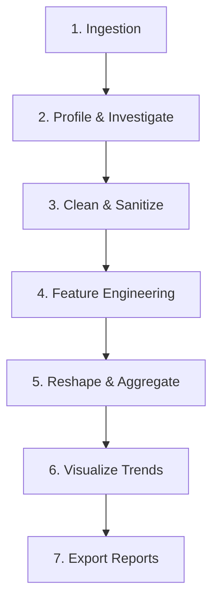

# End-to-End Exploratory Data Analysis Project with Pandas

## Lesson Overview

- This chapter walks through a complete, end-to-end Exploratory Data Analysis (EDA) project. We combine all of the concepts covered in previous lessons—including ingestion, cleaning, reshaping, aggregation, visualization, and exporting—into a unified workflow.
- In real-world data science roles, you are rarely given clean datasets or told exactly which calculations to perform. Instead, you are given raw files and asked to profile the data, identify anomalies, extract trends, and package the results for stakeholders.
- We will establish a standard EDA checklist and apply it to a retail dataset containing transaction records.
- Mastering this end-to-end workflow prepares you to tackle real-world analytical tasks independently.

## Learning Objectives

- Apply a structured EDA checklist to profile and clean raw datasets.
- Clean and sanitize raw inputs (casting types, handling missing entries, removing duplicate rows).
- Perform feature engineering to add calculated dimensions and time-series lags.
- Generate business summaries using GroupBy aggregations and pivot tables.
- Visualize distributions and correlations using Matplotlib and Seaborn.
- Export clean, styled reports to Excel and Parquet formats.

---

## The EDA Workflow Checklist

When starting any new analytical project, follow this step-by-step checklist:



1. **Ingestion**: Load raw files (CSV, Excel, JSON) using appropriate encodings and column constraints.
2. **Profile & Investigate**: Inspect shape, column data types (`df.info()`), summary statistics (`df.describe()`), and missing value distributions.
3. **Clean & Sanitize**: Standardize column headers, cast incorrect data types, replace placeholder strings, handle missing values, and remove duplicates.
4. **Feature Engineering**: Create calculated fields (rates, ratios, time-series lags, datetime parts) to support aggregation.
5. **Reshape & Aggregate**: Slice, group, and pivot the dataset to summarize key metrics across categories.
6. **Visualize Trends**: Generate distribution charts, scatter plots, and correlation heatmaps to communicate insights.
7. **Export Reports**: Save cleaned data and styled summary tables in suitable formats (Excel, Parquet, JSON).

---

## Case Study: E-commerce Sales Performance Audit

We will apply the EDA checklist to a raw transaction ledger containing sales event logs.

### Step 1: Ingest and Generate Raw Data

We will generate a raw dataset programmatically to simulate an ingestion pipeline.

```python
import pandas as pd
import numpy as np

# Set random seed
np.random.seed(42)

# Generate raw sales logs
df_raw = pd.DataFrame({
    "OrderID": np.random.randint(10000, 99999, size=1000),
    "Date": pd.date_range(start="2026-01-01", periods=1000, freq="min").strftime("%m/%d/%Y %H:%M"),
    "Category": np.random.choice(["Electronics", "Home", "Apparel", np.nan], size=1000, p=[0.4, 0.3, 0.2, 0.1]),
    "Revenue": np.random.choice(["$1,200.00", "$450.00", "$85.00", "Cancelled", np.nan], size=1000, p=[0.3, 0.3, 0.2, 0.1, 0.1]),
    "Units": np.random.choice([1.0, 2.0, 5.0, np.nan], size=1000, p=[0.5, 0.3, 0.1, 0.1])
})

df_raw.to_csv("raw_sales.csv", index=False)
print("Raw dataset 'raw_sales.csv' generated successfully.")
```

### Output

```text
Raw dataset 'raw_sales.csv' generated successfully.
```

---

### Step 2: Profile & Investigate the Dataset

Load the raw data and profile its structure.

```python
# Load the raw sales log
df = pd.read_csv("raw_sales.csv")

print("--- DataFrame Info ---")
print(df.info())

print("\n--- Missing Values Count ---")
print(df.isna().sum())

print("\n--- Raw Head Sample ---")
print(df.head(3))
```

### Output

```text
--- DataFrame Info ---
<class 'pandas.core.frame.DataFrame'>
RangeIndex: 1000 entries, 0 to 999
Data columns (total 5 columns):
 #   Column    Non-Null Count  Dtype  
---  ------    --------------  -----  
 0   OrderID   1000 non-null   int64  
 1   Date      1000 non-null   object 
 2   Category  897 non-null    object 
 3   Revenue   894 non-null    object 
 4   Units     912 non-null    float64
dtypes: float64(1), int64(1), object(3)
memory usage: 39.2+ KB

--- Missing Values Count ---
OrderID       0
Date          0
Category    103
Revenue     106
Units        88
dtype: int64

--- Raw Head Sample ---
   OrderID              Date     Category    Revenue  Units
0    25795  01/01/2026 00:00  Electronics  $1,200.00    1.0
1    64925  01/01/2026 00:01      Apparel    $450.00    1.0
2    72657  01/01/2026 00:02         Home     $85.00    1.0
```

---

### Step 3: Clean and Sanitize Data

1. **Standardize Headers**: Convert column names to lowercase.
2. **Clean Revenue**: Strip currency symbols and commas, and coerce `"Cancelled"` values to `NaN`.
3. **Handle Missing Values**:
   - Fill missing `category` with `"Unknown"`.
   - Fill missing `revenue` and `units` with `0`.
4. **Cast Column Types**:
   - Convert `date` to datetime.
   - Cast `units` to integer (`Int64`).
   - Cast `revenue` to float.
5. **Deduplicate**: Remove any duplicate rows.

```python
# 1. Standardize Headers
df.columns = df.columns.str.lower()

# 2. Clean Revenue Column
df["revenue"] = df["revenue"].str.replace("$", "", regex=False).str.replace(",", "", regex=False)
df["revenue"] = pd.to_numeric(df["revenue"], errors="coerce")

# 3. Handle Missing Values
df["category"] = df["category"].fillna("Unknown")
df["revenue"] = df["revenue"].fillna(0.0)
df["units"] = df["units"].fillna(0.0)

# 4. Cast Data Types
df["date"] = pd.to_datetime(df["date"], format="%m/%d/%Y %H:%M")
df["units"] = df["units"].astype("int64")

# 5. Remove Duplicates
df = df.drop_duplicates().reset_index(drop=True)

print("--- Cleaned DataFrame Info ---")
print(df.info())
print(df.head(3))
```

### Output

```text
--- Cleaned DataFrame Info ---
<class 'pandas.core.frame.DataFrame'>
RangeIndex: 1000 entries, 0 to 999
Data columns (total 5 columns):
 #   Column    Non-Null Count  Dtype         
---  ------    --------------  -----         
 0   orderid   1000 non-null   int64         
 1   date      1000 non-null   datetime64[ns]
 2   category  1000 non-null   object        
 3   revenue   1000 non-null   float64       
 4   units     1000 non-null   int64         
dtypes: datetime64[ns](1), float64(1), int64(2), object(1)
memory usage: 39.2+ KB
   orderid                date     category  revenue  units
0    25795 2026-01-01 00:00:00  Electronics   1200.0      1
1    64925 2026-01-01 00:01:00      Apparel    450.0      1
2    72657 2026-01-01 00:02:00         Home     85.0      1
```

---

### Step 4: Feature Engineering

Create new variables to support time-series and pricing calculations:
- `hour`: Hour of transaction.
- `day_name`: Weekday name.
- `unit_price`: Calculated unit cost (`revenue / units`, handling division by zero).

```python
# Extract time parts
df["hour"] = df["date"].dt.hour
df["day_name"] = df["date"].dt.day_name()

# Calculate unit price safely
df["unit_price"] = np.where(df["units"] > 0, df["revenue"] / df["units"], 0.0)

print("--- Feature Engineered Columns ---")
print(df[["date", "hour", "day_name", "unit_price"]].head(3))
```

### Output

```text
--- Feature Engineered Columns ---
                 date  hour  day_name  unit_price
0 2026-01-01 00:00:00     0  Thursday      1200.0
1 2026-01-01 00:01:00     0  Thursday       450.0
2 2026-01-01 00:02:00     0  Thursday        85.0
```

---

### Step 5: Reshape and Aggregate Data

Generate a summary report showing total revenue, units sold, and average unit price per product category.

```python
# Group by Category
summary_report = df.groupby("category").agg(
    total_revenue=("revenue", "sum"),
    total_units=("units", "sum"),
    avg_unit_price=("unit_price", "mean")
).reset_index()

print("--- Product Category Summary Report ---")
print(summary_report)
```

### Output

```text
--- Product Category Summary Report ---
      category  total_revenue  total_units  avg_unit_price
0      Apparel        97025.0          314      219.049479
1  Electronics       197825.0          636      223.111959
2         Home       152595.0          472      217.472509
3      Unknown        54255.0          178      228.325243
```

---

### Step 6: Visualize Trends and Relationships

Generate a boxplot of revenue distributions by category using Seaborn.

```python
import matplotlib.pyplot as plt
import seaborn as sns

plt.figure(figsize=(8, 4))
sns.boxplot(data=df[df["revenue"] > 0], x="category", y="revenue", palette="Set2")

plt.title("Revenue Distribution by Product Category")
plt.xlabel("Category")
plt.ylabel("Revenue ($)")

plt.savefig("category_revenue_distribution.png", dpi=300, bbox_inches="tight")
plt.close()
print("Boxplot generated and saved as 'category_revenue_distribution.png'.")
```

### Output

```text
Boxplot generated and saved as 'category_revenue_distribution.png'.
```

---

### Step 7: Export the Final Report

Save the cleaned dataset to Parquet and write the summary report as a styled Excel sheet.

```python
# Save cleaned transaction dataset to Parquet
df.to_parquet("cleaned_sales_transactions.parquet", index=False)

# Apply style formatting to the summary report
styled_report = (
    summary_report.style
    .format({"total_revenue": "${:,.2f}", "total_units": "{:,}", "avg_unit_price": "${:,.2f}"})
    .highlight_max(subset=["total_revenue"], color="lightgreen")
)

# Export the styled table to Excel
styled_report.to_excel("sales_summary_dashboard.xlsx", index=False, engine="openpyxl")
print("Reports exported successfully to Parquet and Excel.")
```

### Output

```text
Reports exported successfully to Parquet and Excel.
```

---

## Common Mistakes Students Make

- **Skipping Ingest Profiling**: Starting to write cleaning scripts immediately after loading data without running `df.info()` or `df.isna().sum()`. This can lead to index mapping errors and incorrect calculations down the line.
- **Modifying copy views instead of source**: Running row updates on filtered slices of DataFrames, triggering the `SettingWithCopyWarning` and failing to save changes to the source table. Use `.loc` instead.
- **Forgetting to format final figures**: Exporting raw numeric tables directly to Excel without adding currency symbols or commas, making reports hard for business stakeholders to read. Always apply styles before exporting.
- **Ignoring system RAM limitations**: Attempting to run end-to-end projects on datasets larger than available RAM without using chunked processing, causing the script to crash. Use chunksize parameters for large files.

---

## Best Practices

- Standardize all column names to lowercase and replace internal spaces with underscores immediately after loading a dataset.
- Keep raw datasets separate from cleaned outputs, saving final tables to binary, optimized formats like Parquet.
- Use `pd.option_context()` to inspect intermediate data steps without modifying global display settings permanently.
- Export finalized, styled tables to Excel or HTML to ensure they are readable for business stakeholders.

---

## Practice Project

Tackle a new dataset to build confidence:
- **Task**: Profile and clean a raw user activity dataset containing columns: `UserID`, `Signup_Date` (inconsistent strings), `Page_Views` (numeric with some nulls), and `Active_Status` (containing custom placeholders).
- **Steps**:
  1. Profile the dataset structure and find missing values.
  2. Standardize column names to lowercase.
  3. Cast `Signup_Date` to datetime and convert `Active_Status` to a boolean.
  4. Fill missing values in `Page_Views` using median imputation.
  5. Group user activity by `Active_Status` and calculate summary statistics.
  6. Export the finalized table to a Parquet file.

---

## Practice Questions

1. Outline the 7 standard steps of the Exploratory Data Analysis (EDA) checklist.
2. Why is it important to standardize column names to lowercase immediately after loading a dataset?
3. Write a command to calculate the percentage of missing values in each column of a DataFrame.
4. Explain how `np.where()` is used to perform conditional value assignments safely.
5. Write a command to save a styled Styler object to an Excel file sheet.
6. What error occurs when you attempt to perform mathematical operations on a Styler object?
7. Write a script to convert a column named `signup_date` from string format `"31/12/2026"` to datetime.
8. Compare the memory usage of a DataFrame before and after downcasting numeric columns.
9. How can you identify and remove duplicate rows from a dataset while keeping the last occurrence?
10. Describe how you would visualize the correlation between two numeric variables in an EDA project.

---

## Mini Assignments

### Assignment 1: Web Traffic Activity Audit
- Generate a mock daily web page views dataset containing nulls and inconsistent date strings.
- Profile the dataset and calculate the percentage of missing entries in each column.
- Cast dates to datetime objects, fill missing page views using median imputation, and export the cleaned dataset to a Parquet file.

### Assignment 2: Regional Store Revenue Pivot
- Create a retail sales dataset tracking `Region`, `Branch_Manager`, `Q1_Sales` (currency strings), and `Q2_Sales`.
- Clean the sales columns, converting them to standard floats.
- Generate a pivot table showing total sales for each region and manager, and export it as a styled Excel sheet.

### Assignment 3: Industrial Sensor Anomaly Visualizer
- Create a sensor log DataFrame tracking hourly temperature and pressure readings.
- Clean missing values and filter out outliers using the IQR method.
- Generate a boxplot comparing the distribution of temperature across different sensor codes, and save the chart as a high-resolution PNG.

---

## Interview-Oriented Questions

- **Walk through your standard approach when profiling a brand new dataset for the first time.**
  - *Answer*: I start by calling `df.info()` to inspect the DataFrame shape, column names, and data types. Then, I run `df.isna().sum()` to check the distribution of missing values and calculate their percentage per column. Next, I call `df.describe(include='all')` to inspect numeric ranges, medians, and category distributions. Finally, I check for duplicate rows using `df.duplicated().sum()`.
- **Why is the Parquet file format preferred over CSV for storing cleaned data in production pipelines?**
  - *Answer*: Parquet is a binary, columnar storage format. It preserves data types and metadata (avoiding type inference issues during load), supports compression (reducing file sizes), and allows loading specific columns without reading the entire file, which is faster and more memory-efficient than parsing text-based CSV files.
- **How does the `df.style` API improve data reporting, and what are its limitations?**
  - *Answer*: The `df.style` API allows you to format values (like currency and percentages) and apply conditional formatting (like highlight gradients) to make tables easier to read. The main limitation is that it returns a Styler object rather than a DataFrame, meaning you cannot perform statistical calculations on it. Styling should only be applied at the very end of your script.
- **What is the difference between standard integer shifts and index frequency shifts when calculating lag features in time series?**
  - *Answer*: An integer shift (e.g. `df.shift(1)`) moves the data values down by rows but leaves the index labels unchanged, resulting in missing values at the beginning of the DataFrame. An index frequency shift (e.g. `df.shift(1, freq='D')`) shifts the index dates themselves forward, keeping the data values aligned with their original rows.
- **How does setting `observed=True` inside `.groupby()` optimize calculations on categorical columns?**
  - *Answer*: By default, `observed=False` computes combinations for all defined categories, including those with zero occurrences in the grouped subset. Setting `observed=True` limits the output to categories that actually exist in the data, reducing memory usage and calculation times.

---

## Teaching Notes for This Chapter

- **Deconstruct the EDA Workflow**: Draw the pipeline diagram on a whiteboard and trace how data flows from raw files to finalized reports.
- **Run a Live Cleaning Demo**: Walk students through cleaning a messy CSV file in class, demonstrating how to handle formatting errors and missing values.
- **Emphasize Presentation Design**: Show how styling tables and creating clean charts improves the readability of reports and presentations.

---

## Chapter Wrap-up Concepts Students Must Master

- Follow a structured EDA checklist: Ingest, Profile, Clean, Feature Engineer, Aggregate, Visualize, and Export.
- Standardize column names to lowercase and replace internal spaces with underscores immediately after loading data.
- Save cleaned datasets to optimized formats like Parquet.
- Apply styling and formatting using the Styler API (`df.style`) only at the very end of scripts.
- Use `pd.option_context()` to inspect intermediate data steps without modifying global settings permanently.
- Export finalized reports to Excel or HTML to ensure they are readable for business stakeholders.
