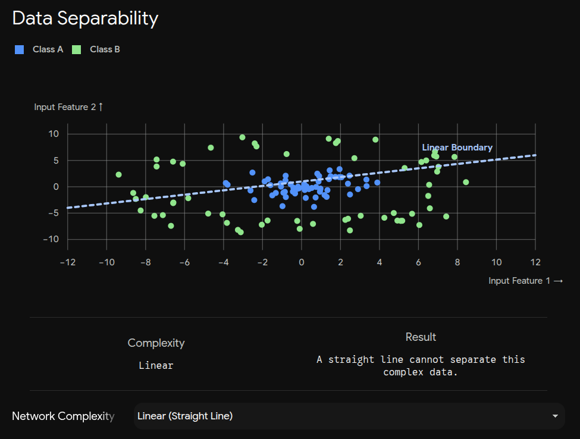
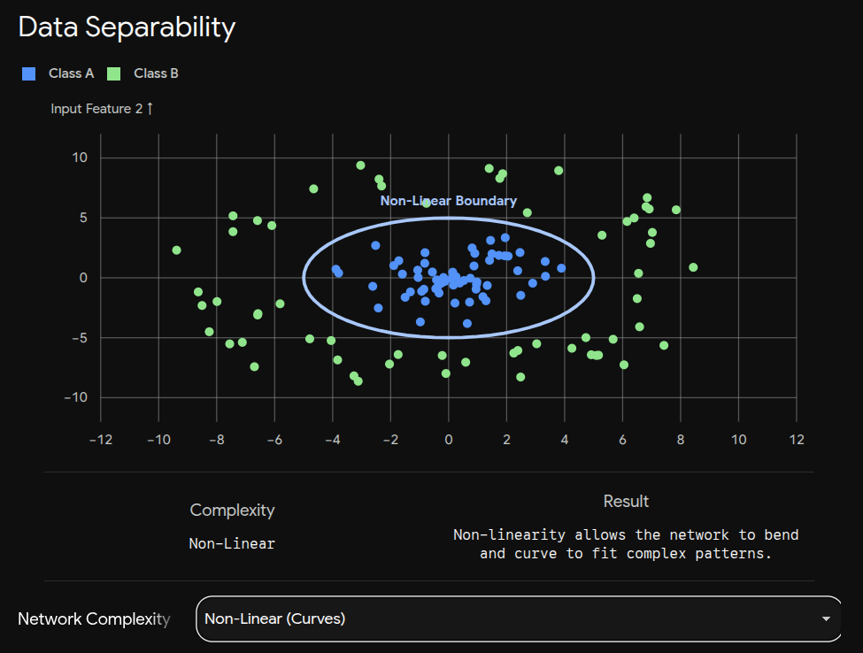
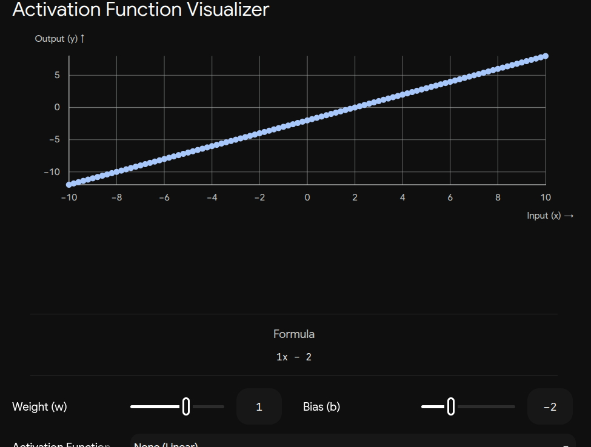
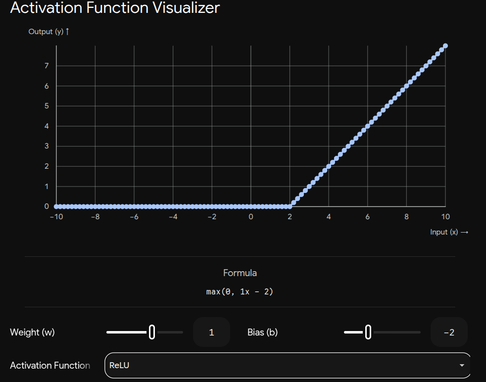

## I think first of all we need to understand in depth the cocept of linearity and non-linearity to understand activation functions! and why we need it in depth! but simple english for beginners!

### **1. What is Linearity? (The Straight Line)**

In simple terms, **linear means a straight line**.

Think of buying apples at a grocery store. If 1 apple costs $2, then 2 apples cost $4, and 10 apples cost $20. The relationship is perfectly steady, proportional, and predictable. If you were to map this out on a graph, it would draw a perfectly straight line going up.

In mathematics, this is your classic $y = mx + b$.

When you build a basic neural network layer and _don't_ give it an activation function, it just does basic multiplication and addition. It is essentially a giant calculator that can only draw straight lines.

### **2. The Problem with Pure Linearity**

Here is the fatal flaw of linear math in deep learning: **Straight lines stacked on top of each other just make another straight line**.

Imagine a factory assembly line where Machine A multiplies everything by 2, and Machine B multiplies everything by 3. Mathematically, $2 \times (3x) = 6x$. You didn't create a smarter, more complex machine by stacking them; you just created a single machine that multiplies by 6. No matter how many linear layers you add to a neural network, it will only ever be able to understand the world in straight lines.

The real world is almost never a straight line! Think about the MNIST dataset of handwritten digits. A handwritten "8" is full of loops, curves, and sudden stops. If your neural network can only draw straight mathematical lines, it will never be able to trace an "8" or separate it from a "1". A network like that could never learn to recognize highly complex, real-world patterns.

### **3. What is Non-Linearity? (The Magic of Curves)**

**Non-linear means anything that is NOT a straight line.** It can be a curve, a zig-zag, a step, or a sudden drop-off.

To understand complex data, we need our network's math to be able to bend, fold, and wrap around shapes. This is exactly what activation functions do! They act as a mathematical "hinge."

By applying a non-linear rule at the very end of a neuron's calculation, we break the straight line. For example, ReLU is a strict gatekeeper: if a calculation results in a negative number, ReLU forcefully turns it to exactly 0. That sudden rule change creates a "bend" or a "corner" in the math. These functions introduce curves (non-linearity) into the network.

---

### **Visualizing the Difference**

To truly grasp why this matters, imagine we have a dataset that looks like a donut: a cluster of data points in the middle (Class A), surrounded by a ring of other data points (Class B).

A linear network can only throw a straight stick across the data to try and separate them. A non-linear network can bend its boundary into a circle to trap the middle dots. Try toggling between the two in this interactive visualization to see why straight lines fail!

---

## Let's visualize why we absolutely need the network to bend and curve to learn real-world shapes, using how a specific function (like ReLU or Sigmoid) actually creates that bend mathematically on a neuron level

To understand this, we have to look at what a single neuron is doing right before the activation function kicks in.

### **Step 1: The Raw Neuron (The Straight Line)**

Before any gatekeeping happens, a neuron does one basic calculation. It multiplies your input data by a **Weight** ($w$), and adds a **Bias** ($b$).

The math looks like this:
$z = w \cdot x + b$

If you remember high school algebra, that is literally the equation for a straight line ($y = mx + b$)!

Without an activation function, the neuron just outputs $z$. It is essentially a giant calculator that can only draw straight lines.

---

### **Step 2: Adding ReLU (Creating the Corner)**

Now, let's pass that straight line through a ReLU activation function.

As a reminder, ReLU acts as a strict gatekeeper: if a calculation results in a negative number, ReLU forcefully turns it to exactly 0. If it's a positive number, ReLU lets the exact signal pass through untouched.

Let's pretend our neuron's weights and biases resulted in the equation $z = 1 \cdot x - 2$. Let's feed it some inputs ($x$):

- If input $x = 0$, $z = -2$. Because it's negative, ReLU forces the output to **0**.
- If input $x = 1$, $z = -1$. Because it's negative, ReLU forces the output to **0**.
- If input $x = 2$, $z = 0$. ReLU outputs **0**.
- If input $x = 3$, $z = 1$. Because it's positive, ReLU outputs **1**.
- If input $x = 4$, $z = 2$. Because it's positive, ReLU outputs **2**.

**The Mathematical Bend:** If you graph those outputs, any input less than 2 draws a completely flat, horizontal line at zero. But the exact moment $x$ hits 2, the line suddenly hinges upwards at a 45-degree angle.

By applying a simple rule, we broke the straight line and created a sharp corner!

---

### **Step 3: Adding Sigmoid (Creating the Curve)**

What if we used Sigmoid instead?

Sigmoid is a function that takes any number (no matter how huge or deeply negative) and "squishes" it into a value strictly between **0 and 1**.

Instead of creating a sharp corner like ReLU, Sigmoid grabs the extreme ends of our straight line ($z = w \cdot x + b$) and forces them to flatten out as they get closer to 0 or 1. It bends the straight line into a graceful "S" shape.

### **Why This is a Superpower**

One sharp corner or one S-curve might not seem like much. But a hidden layer with 128 neurons means you have 128 different corners or curves. By tweaking the weights ($w$) and biases ($b$), the network can shift where those corners happen and point them in different directions. By stitching hundreds of these bent lines together, the network can literally trace the curved outline of a dog or draw a complex boundary around a cluster of data points.

You can experiment with this mathematical hinge yourself using the tool below. Try adjusting the Weight ($w$) and Bias ($b$) to change the underlying straight line, and switch between activation functions to see how they uniquely bend or snap the line to create non-linearity!

