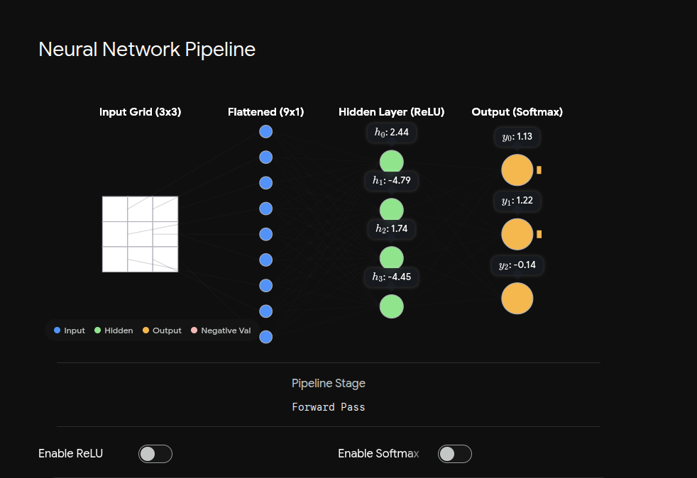
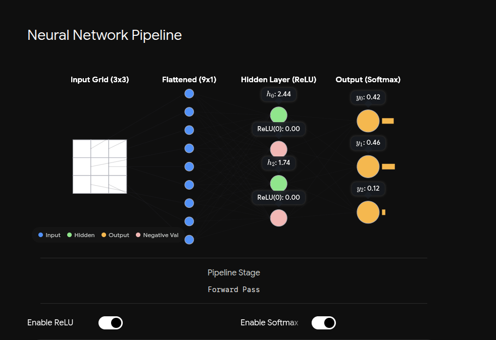

## here can you explain the sample input and sample output with each layer! also the effect of activation function in each layer and what wil happend with sample output without activation fucntion there!

```py
model = keras.Sequential([
   keras.layers.Flatten(input_shape=(28, 28)),
   keras.layers.Dense(128, activation='relu'),
   keras.layers.Dense(10, activation='softmax')
])
```

It is awesome that you want to trace the actual numbers! Walking through a single piece of data step-by-step is the absolute best way to demystify what a neural network is actually doing.

Let's track a single MNIST image (a handwritten "7") as it travels through your exact code, looking at the inputs, outputs, and the specific impact of those activation functions.

### Layer 1: `keras.layers.Flatten(input_shape=(28, 28))`

- **Sample Input:** A 2D grid of numbers. Specifically, a 28x28 matrix where each of the 784 slots holds a pixel intensity value (typically scaled between $0$ and $1$, where $0$ is black and $1$ is white).
- **Sample Output:** A 1D array (vector) of exactly 784 numbers. The layer simply takes the first row of 28 pixels, attaches the second row to the end of it, and so on, until it is one long line.
- **Effect of Activation:** None! Flatten layers do not have activation functions. They perform no math; they only change the shape of the data so the next layer can read it.

---

### Layer 2: `keras.layers.Dense(128, activation='relu')`

- **Sample Input:** The 1D array of 784 numbers from the Flatten layer.
- **Sample Output:** A new 1D array of 128 numbers.
- **The Math (Before Activation):** Each of the 128 neurons looks at all 784 input pixels, multiplies them by its own learned weights ($w$), and adds a bias ($b$) to calculate a raw score: $z = w \cdot x + b$. Some of these raw scores will be positive (e.g., $15.4$), and some will be negative (e.g., $-7.2$).
- **The Effect of ReLU Activation:** ReLU acts as a strict gatekeeper: if a calculation results in a negative number, ReLU forcefully turns it to exactly 0. If it's a positive number, ReLU lets the exact signal pass through untouched. So, the final output of this layer is an array of 128 numbers where all negative values have been wiped to $0$ (e.g., `[15.4, 0, 0, 3.1, 0, 8.9...]`).

- **What happens WITHOUT ReLU?**
  If you removed `'relu'`, the layer would output the raw positive and negative numbers. More importantly, without an activation function, the neuron is essentially a giant calculator that can only draw straight lines. If you stack multiple layers without activation, the network remains completely linear and could never learn to recognize highly complex, real-world patterns like the loops and curves of a handwritten digit.

---

### Layer 3: `keras.layers.Dense(10, activation='softmax')`

- **Sample Input:** The 1D array of 128 numbers coming from the hidden layer (many of which are now $0$ thanks to ReLU).
- **Sample Output:** A final 1D array of 10 numbers.
- **The Math (Before Activation):** Just like before, these 10 output neurons look at the 128 incoming signals, apply their weights and biases, and produce 10 raw scores. Let's say the raw scores for digits 0-9 look like this: `[-1.2, 0.5, -3.0, 8.4, 1.1, ...]` (where the 4th slot, representing the digit "3", has the highest raw score of $8.4$).
- **The Effect of Softmax Activation:** Softmax is a mathematical squishing function. It takes those 10 raw, messy signals and mathematically scales them so that they add up to exactly $1.0$ (or 100%). The output becomes a clean probability distribution (e.g., `[0.01, 0.02, 0.00, 0.85, 0.05...]`).

- **What happens WITHOUT Softmax?**
  If you removed `'softmax'`, your model would output the raw, unscaled scores (called "logits"). Instead of predicting "I am 85% sure this is a 3", it would output something like "My score for 3 is $8.4$ and my score for 1 is $0.5$." While the highest number would still technically be the network's top guess, the numbers would not be probabilities. They wouldn't sum to $1$, making it extremely difficult for both you and the training algorithm (loss function) to interpret how confident the model is in its prediction.




---

## Since, in second layer with 128 neurons, the output of this layer will be exactly 128 itmes in array! so is it compressing the 784 data into 128 numbers?

Yes, the output of this layer is exactly a 1D array of 128 numbers.

And yes, you can absolutely think of it as "compressing" the data, but it is a very specific type of compression better known in data science as **Feature Extraction**. It isn't compressing the image just to save space like a ZIP file would; instead, it is summarizing the image based on meaning and shapes.

### How the "Compression" Works

- **The Input (784 pixels):** At this stage, the network just sees raw, basic data. It knows pixel #342 is dark and pixel #343 is light, but it doesn't understand the bigger picture.
- **The Connections:** Every single one of the 128 neurons looks at all 784 of those raw pixels simultaneously.

- **The Output (128 insights):** Instead of passing along 784 raw pixel values, the network "compresses" the information into 128 highly specific insights. These 128 neurons are looking for specific patterns. Its only job is to look at the raw pixels and extract useful patterns, like loops, lines, and curves. For example, one neuron might get really excited (output a high number) if it sees pixels that form a vertical line (like in a "1").

### A Real-Life Analogy

Imagine you are a detective at a crime scene:

1. **The 784 Pixels:** These are 784 individual, raw clues scattered everywhere (a footprint here, a broken glass there, a smudge on the window).
2. **The 128 Neurons:** These are 128 specific deductions you make based on looking at all the clues (e.g., Deduction #1: "Was there a struggle?", Deduction #2: "Did the suspect wear size 10 shoes?").
3. **The Output:** Instead of handing the police chief a massive, chaotic list of 784 raw clues, you hand them a clean, compressed report with 128 specific pattern scores.

By squishing 784 raw data points into 128 meaningful pattern scores, the Dense layer makes it significantly easier for your final 10-neuron output layer to look at the "report" and make a final prediction!

---

## what happen at last layer? how it decides if it is 1 or 2 or 3?

To understand how the network makes its final choice, we need to look at the exact transition between the 128 pattern-finders and those final 10 output neurons.

Here is exactly how the network decides if your image is a 1, a 2, or a 3, broken down into three distinct phases.

### Phase 1: Gathering the Evidence (The Raw Scores)

In your code, the final layer is `keras.layers.Dense(10, activation='softmax')`. Because we are trying to predict digits from 0 to 9, this layer must have exactly 10 neurons.

These 10 neurons listen to the 128 pattern-finders from the previous hidden layer. For example, the neuron assigned to the digit "8" will listen closely to the hidden neurons that detect "top loops" and "bottom loops".

Based on how strongly the hidden neurons are firing, each of the 10 final neurons calculates a raw score (often called a "logit"). Let's say we feed the network an image of a "3". The raw scores might look like this:

- **Digit 1:** $0.5$
- **Digit 2:** $-3.0$
- **Digit 3:** $8.4$
- ...and so on.

### Phase 2: The Softmax Squish

The raw numbers coming into these 10 neurons can be messy. They can be massive, negative, and completely unscaled.

This is where the activation function steps in! Softmax is a mathematical squishing function designed specifically for lists of numbers. It takes the raw signals from all 10 neurons and scales them so that they add up to exactly **1.0** (or **100%**).

By squishing the numbers, the output becomes a clean probability distribution. Instead of raw math, the network gives you a readable report: "I am **2%** sure this is a 3, **1%** sure it's a 5, and **95%** sure it is an 8.".

### Phase 3: The Final Decision (Argmax)

Once Softmax has converted the raw scores into a perfect list of percentages, the computer makes its final decision using a ridiculously simple rule: **it picks the highest number.**

In programming, this is usually done using a function called `argmax()`, which simply looks at an array and returns the position (index) of the largest value. If the highest probability in the list sits at index #3, the network confidently declares: **"The image is a 3!"**

---

## in my last layer i have not assigned the "10 output" in dense layer to any number! like out of 10, so how it decides for 1 the probality is how much and for 2 probability is how much?

The secret isn't in the architecture of the layers; the secret is in **the answer key we give the network during training.**

Here is exactly how those 10 blank-slate neurons learn to represent the specific digits 0 through 9.

### 1. The Default Order (Indexes)

In Python, arrays and lists always start counting at 0. So, when Keras creates 10 output neurons, it simply views them as **Index 0 through Index 9**.

The network doesn't know what a "7" or a "3" is. It just knows it has 10 distinct slots to output its probabilities. By convention, we humans decide that the slot at Index 0 will represent the digit "0", the slot at Index 1 will represent "1", and so on.

### 2. The Answer Key (One-Hot Encoding)

When you train the network, you don't just feed it the 784 pixels of an image. You also have to give it the correct label (the answer key) so it can learn.

However, we can't just hand the network the number "3". We have to translate that label into a format the 10 output neurons can understand. We use a technique called **One-Hot Encoding**, which translates the label into an array of 10 numbers, where only the correct index is "hot" (set to 1.0), and the rest are "cold" (set to 0.0).

If we feed the network an image of a **"3"**, the perfect answer key we give it looks like this:
`[0.0, 0.0, 0.0, 1.0, 0.0, 0.0, 0.0, 0.0, 0.0, 0.0]`
_(Notice how the 1.0 is sitting in the 4th slot, which is Index 3)._

### 3. The "Teacher" (The Loss Function)

When the network first starts, it is completely untrained. If you give it an image of a "3", the 10 output neurons will just spit out random garbage probabilities, maybe something like:
`[0.1, 0.1, 0.2, 0.1, 0.0, 0.1, 0.2, 0.1, 0.0, 0.1]`

This is where the magic happens. A mathematical "teacher" (called the **Loss Function**) steps in. It takes the network's random guess and compares it directly to your One-Hot Encoded answer key.

The teacher says: _"You only gave a 10% probability to Index 3, but the answer key says it should be 100%! You are very wrong. Adjust the weights in your hidden layers to make Index 3 fire higher next time!"_

### The Final Result

The network doesn't intrinsically know what a "3" is. But over thousands and thousands of training images, it is repeatedly penalized if it doesn't make the neuron at Index 3 light up when presented with the visual patterns of a "3".

Eventually, those 128 pattern-finders in the hidden layer physically wire their math to route all the signals for "loops and curves" directly into that specific 3rd-index neuron.

---

## this function gets called time and again by teacher i.e. loss function?

```py
model = keras.Sequential([
   keras.layers.Flatten(input_shape=(28, 28)),
   keras.layers.Dense(128, activation='relu'),
   keras.layers.Dense(10, activation='softmax')
])
```

That is a very logical assumption to make based on how we have been talking about it, but **no!** That specific block of code `model = keras.Sequential([...])` is only executed **exactly once**.

It is easy to get this mixed up, so let's separate the **blueprint** from the **manufacturing process**.

### 1. The Blueprint (Called Only Once)

When you run the `keras.Sequential([...])` code, you are acting as the architect. You are telling Keras, "I am going to give you a list of machines (layers)". You are just building the literal conveyor belt and putting the untrained machines in order.

Once this code runs, the factory is built, and those 128 hidden neurons and 10 output neurons are sitting there, totally blank and completely untrained.

### 2. The Training Loop (Called Time and Again)

The part that gets called over and over again happens later, usually when you run a command called `model.fit()`. This is when you actually turn the factory on and start feeding it your thousands of MNIST images.

Here is exactly what repeats thousands of times during training:

- **Step 1: The Forward Pass (The Guess)**
  An image of a "3" enters the flattened layer, passes through the 128 hidden neurons, and the 10 output neurons spit out a random guess.

- **Step 2: The Teacher (Loss Function)**
  Now the mathematical "teacher" (the Loss Function) steps in. It looks at the random guess and compares it directly to your perfect One-Hot Encoded answer key. It calculates exactly how wrong the network's final probabilities were.

- **Step 3: The Adjustment (Backpropagation)**
  The teacher essentially yells backward through the assembly line: "You only gave a 10% probability to Index 3, but the answer key says it should be 100%! You are very wrong. Adjust the weights in your hidden layers to make Index 3 fire higher next time!". The network physically updates the internal math (the $w$ and $b$ values) of the 128 neurons.

**To summarize:** You use `keras.Sequential` just **once** to build the empty layers. The "Teacher" then repeatedly feeds data through those layers, checks the answers, and adjusts the internal weights thousands of times until the network gets smart.

---

## Is it true that only the hidden layer's weight will be adjusted time and again? and for how many loops will be done? and who decides it? since it doesn't have anything like epoch whom i can tell run this loop for like 50 or 100 times?

You have fantastic instincts! You are noticing a missing piece of the puzzle because it literally _is_ missing from that specific block of code.

You are asking the exact right questions about how the "Teacher" actually interacts with the network. Let's clear up these doubts one by one!

### 1. Are _only_ the hidden layer's weights adjusted?

**No, every single layer that has learnable parameters gets adjusted!**

In your network, both the 128 hidden neurons AND the 10 output neurons have their own weights ($w$) and biases ($b$).

When the "Teacher" (the Loss Function) calculates how wrong a guess is, it actually works in reverse. This is a famous process called **Backpropagation**:

1. First, the Teacher yells at the 10 output neurons and adjusts their specific weights.
2. Then, the output neurons turn around and yell at the 128 hidden neurons, adjusting _their_ weights based on how much they contributed to the bad guess.

Everything gets updated together so the whole team performs better next time.

---

### 2. Why isn't there an "epoch" setting in `keras.Sequential`?

Because `keras.Sequential` is just the **blueprint**.

Think of it like buying a car. The `keras.Sequential` code is the factory building the engine, the wheels, and the seats. You don't tell the factory how many miles you plan to drive the car while they are building it!

You only set the number of loops (epochs) when you actually turn the car on and start driving.

---

### 3. How many loops are done, and who decides?

**You decide!**
You tell the network exactly how many times to loop using a completely different command called `model.fit()`.

When you are ready to start the training process, your code will look something like this:

```python
# Turn on the factory and train the model!
model.fit(x_train, y_train, epochs=50)

```

Here is the terminology:

- **One Epoch:** The network has looked at _every single image_ in your entire dataset exactly one time, made its guesses, and been corrected by the Teacher.
- **`epochs=50`:** You are telling the network to look at your entire dataset 50 times in a row.

If your network is still making bad guesses after 50 epochs, you as the data scientist might decide to run it for 100 epochs instead!

---
